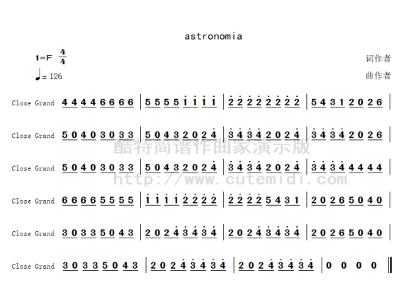
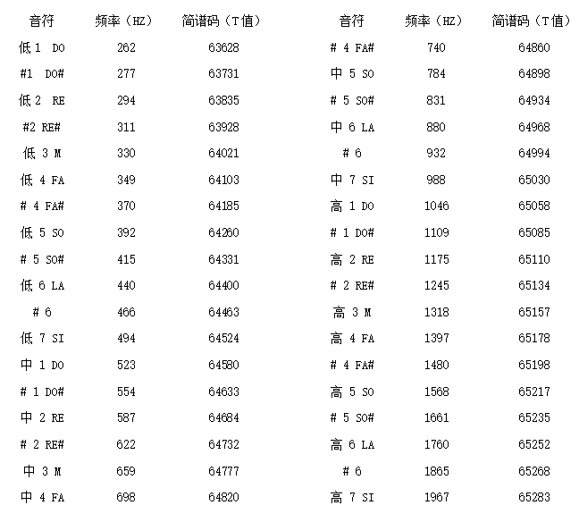

# 黑人抬棺主题曲 Astronomia 的实现

## Ⅰ.手机拨号键实现 Astronomia 弹奏

- 第一步，手机设置拨号键音为“钢琴”或者“旋律”

- 第二步，打开手机拨号键盘弹奏乐谱

音阶手机拨号键对应表如下：

[效果视频](./phone/phoneAstronomia.mp4)

## Ⅱ.Python 实现 Astronomia 演奏

[python实现](./py/audiotest.py)

[效果音频](./py/Astronomia.m4a)
